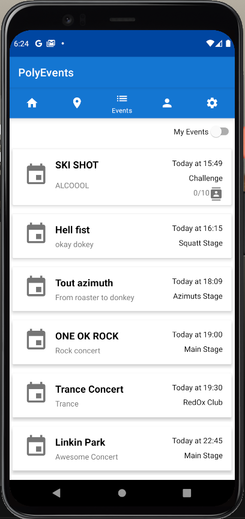
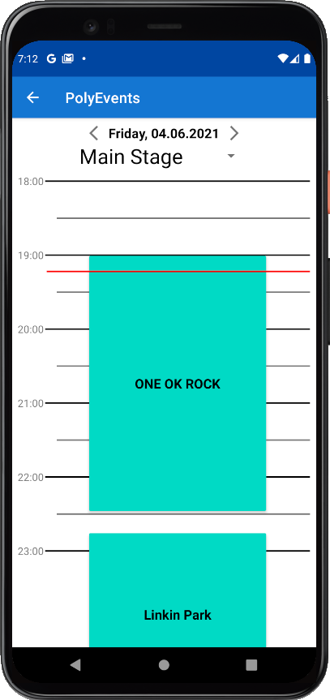
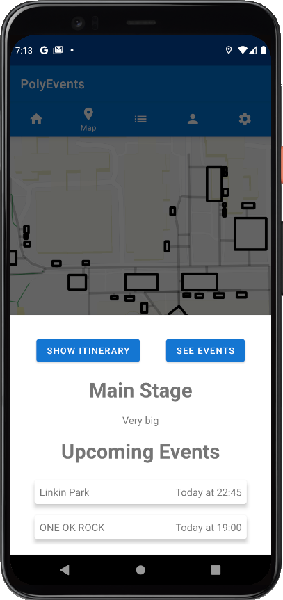
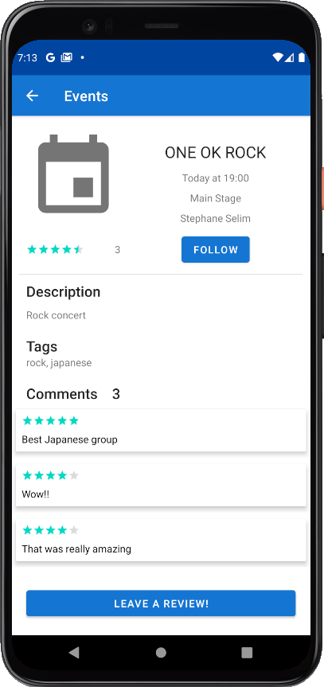
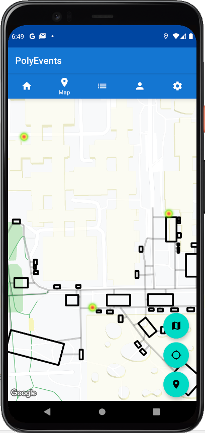
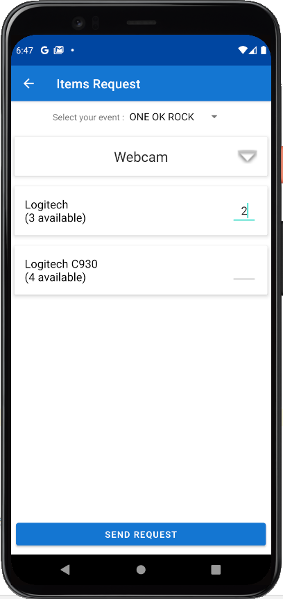
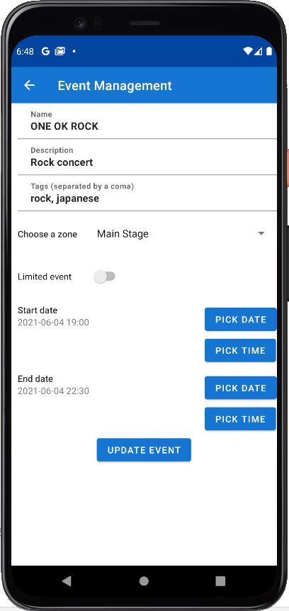
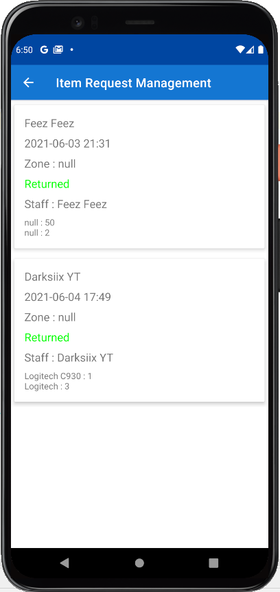

# PolyEvents

PolyEvents is an event management application destined for both users attending events as well as 
the event organizers and staff.

## Going to an event with PolyEvents
As a user attending an event, you will make the most out of your event with PolyEvents.

You can view which events are happening, the way you like it. Whether as a simple list:

a timetable: 

or on the map by clicking on a zone:

Some events might have a limited number of slots available for attendees. You can 
check easily which events have free slots and subscribe to them. You can also follow events and
in both cases you will receive a notification when the event starts.

You could also user reviews for certain events before going, or leave your own!

And most importantly, make use of our map of the event to see where you are, details of the zones
and of course the HeatMap! If users have set `send location` in their settings, you will see a heat signatures
on the map where there is more activity and possibly find the most interesting zones for you to check out!

## Event Management (Organiser side)
As a festival or event organizer, you will get the full benefits of an event management application
including event creation editing for users to see in real-time, zone management and most importantly 
inventory management, all that in one simple to use application.

### Staff
As a member of staff running a stand at the event, you request items you need to run your stand

### Admin
As an admin you can create or edit an event's details

You can also respond to staff's request for items

## Footer
This application has been developed as part of the Software Development Project (SDP) bachelor course
at EPFL.
